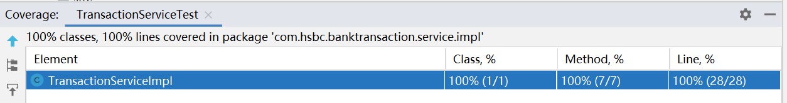

# 银行交易管理系统 Bank Tranction Management System

## 项目介绍 Project Introduction


本项目是一套用于银行领域的交易管理系统，基于SpringBoot+H2内存数据库+JPA实现，采用Docker容器化部署。支持对交易的新增、修改、删除和查询。整体架构采用经典MVC分层架构设计，API接口采用RESTful API设计风格。同时提供请求参数验证、业务异常处理、本地缓存机制等功能特性。最后进行了完善的单元测试和压测，保证系统的性能和稳定性。

This project is a transaction management system used in the banking field, implemented based on SpringBoot + H2 + JPA, and deployed in a containerized manner using Docker. It supports the creation, modification, deletion, and query of transactions. The overall architecture is designed with the classic MVC hierarchical architecture, and the API interfaces are designed in the RESTful API style. At the same time, it provides functional features such as request parameter validation, business exception handling, and local caching mechanism. Finally, comprehensive unit tests and stress tests have been carried out to ensure the performance and stability of the system.

## 项目结构 Project Structure

``` lua
src
├── base -- 工具类及通用代码
├── config -- 配置类
├── controller -- 控制器
├── dao -- 数据访问
├── domain -- 实体类
└── service -- 服务层
```
``` lua
src
├── base -- Utility classes and general code
├── config -- Configuration classes
├── controller -- Controllers
├── dao -- Data access
├── domain -- Entity classes
└── service -- Service layer
```

## 技术栈 Technology Stack

| 技术                 | 说明                | 官网                                           |
| -------------------- | ------------------- | ---------------------------------------------- |
| SpringBoot           | Web应用开发框架      | https://spring.io/projects/spring-boot         |
| Spring JPA           | 数据访问层             | https://spring.io/projects/spring-data-jpa/ |
| H2 Database          | 内存数据库     | https://www.h2database.com/    |
| Spring Cache         | 缓存            | https://github.com/spring-guides/gs-caching      |
| Spring Validation    | 数据验证            | https://spring.io/projects/spring-boot        |
| Docker               | 应用容器引擎        | https://www.docker.com                         |
| Lombok               | Java语言增强库      | https://github.com/rzwitserloot/lombok         |


| Technology                 | Description                | Official Website                                           |
| -------------------- | ------------------- | ---------------------------------------------- |
| SpringBoot           | Web application development framework      | https://spring.io/projects/spring-boot         |
| Spring JPA           | Data access layer             | https://spring.io/projects/spring-data-jpa/ |
| H2 Database          | In-memory database     | https://www.h2database.com/    |
| Spring Cache         | Caching            | https://github.com/spring-guides/gs-caching      |
| Spring Validation    | Data validation            | https://spring.io/projects/spring-boot        |
| Docker               | Application container engine        | https://www.docker.com                         |
| Lombok               | Java language enhancement library      | https://github.com/rzwitserloot/lombok         |

## 搭建步骤 Setup Steps

> 本地部署 Local Deployment

 本地启动BankTransactionApplication。

 Start the BankTransactionApplication locally.

> Docker部署 Docker Deployment

 构建 Build：docker buildx build -t bank-transaction:latest .

 部署 Deployment：docker run -p 8080:8080 bank-transaction:latest


## API接口 API Interfaces
 1. 新增交易Add a transaction
 2. 更新交易Update a transaction
 3. 根据ID查询交易Query a transaction by ID
 4. 查询所有交易Query all transactions
 5. 分页查询Paged query

## 单元测试 Unit Tests

 代码覆盖率100%
 The code coverage is 100%.
 
 


## 压测 Stress Tests

 测试计划
Test Plan
 
 


 测试结果
 Test Results
 
 


 报告
 Report
 
 [HttpReport.zip](/jmeter/HttpReports.zip)

